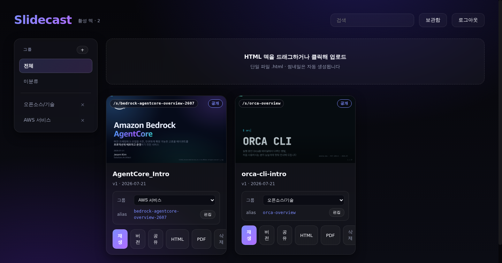

# Slidecast

html-slide로 만든 self-contained HTML 슬라이드 덱을 누적/수정(버전)/삭제하고,
갤러리에서 선택해 풀스크린으로 재생하는 서버리스 웹 뷰어. 그룹 관리, 짧은 URL
alias, public 공유(`/p/{token}`), HTML/PDF 다운로드를 지원한다.

- 배포 대상: AWS (리전 `us-east-1`), CloudFront + Cognito + API Gateway + Lambda + DynamoDB + S3
- 스택: React + Vite + TypeScript(뷰어), Python Lambda(백엔드), AWS CDK(IaC)



## 아키텍처

```
개발자 로컬 ──(local skill: AWS 자격증명)──┐
                                              ▼ 직접 PUT + PutItem
사용자 브라우저                          S3(slides) + DynamoDB(SlideDecks)
   │                                          ▲
   ▼ HTTPS                                    │ (썸네일 캡처)
CloudFront (단일 배포, OAC)          Thumbnail Lambda (container image, Chromium)
   ├─ /            → S3 (React 뷰어 SPA)       ▲
   ├─ /slides/*    → S3 (덱 .html, OAC 비공개)  │ S3 이벤트 트리거
   ├─ /thumbnails/*→ S3 (썸네일 PNG)            │
   └─ /api/*       → API Gateway (HTTP API)
                       └─ Cognito JWT authorizer
                            └─ API Lambda ─→ DynamoDB / S3 presign
Cognito User Pool (셀프가입 차단, 관리자 사용자 1개) + Hosted UI
```

- ALB/퍼블릭 인바운드 없음. S3는 완전 프라이빗, CloudFront OAC로만 접근.
- `/api`는 전부 Cognito JWT authorizer 뒤. 뷰어는 id_token을 Bearer로 전송.
- 덱은 버전 관리: `slides/{deckId}/v{n}/index.html`, `thumbnails/{deckId}/v{n}.png`.
- 버전 번호는 단조 증가(`max(n)+1`) — 롤백 후 재업로드해도 이전 버전을 덮어쓰지 않음.
- 버전 레코드는 API가 업로드 시점에 생성(권위), 썸네일 Lambda는 thumbnailKey만 채움.

## 구성 요소

| 경로 | 역할 |
|------|------|
| `infra/` | AWS CDK (Python) 스택 — S3, CloudFront, Cognito, API GW, Lambda, DDB |
| `lambdas/api/` | HTTP API 핸들러 (목록/업로드/버전/롤백/소프트·하드 삭제/복원) |
| `lambdas/thumbnail/` | S3 이벤트 → Chromium 헤드리스 첫 화면 캡처 (컨테이너 이미지 Lambda) |
| `shared/deck_model.py` | 불변 덱/버전 데이터 모델 (API·썸네일·스킬 공용) |
| `viewer/` | React + Vite + TS SPA (다크 시네마틱) |
| `skill/slidecast-append/` | Claude Code 로컬 스킬 — AWS 자격증명으로 직접 S3+DDB 업로드/버전/삭제 |

## 데이터 모델 (DynamoDB `SlideDecks`)

- 덱 아이템: PK `deckId` (파일명 슬러그), `type="deck"`
  - 속성: `title, tags[], group(null=미분류), alias(null), publicToken(null), status(active|archived), currentVersion, versions[], createdAt, updatedAt`
  - `versions[]` 항목: `{n, createdAt, thumbnailKey, sizeBytes, slideCount, pdfKey}`
- 그룹 메타 아이템: PK `GROUP#{groupId}`, `type="group"`, `{groupId, name, createdAt}` (같은 테이블 공존)
- alias 예약 아이템: PK `ALIAS#{alias}` (원자적 유일성). public 예약 아이템: PK `PUBLIC#{token}`, `{ownerDeckId, publicVersion}` — 조건부 쓰기로 원자 예약, GSI 미참여.
- GSI `byUpdatedAt` (PK `status`, SK `updatedAt`) — 갤러리 최신순
- GSI `byAlias` (PK `alias`, sparse) — alias 유일성/리졸브. alias 없는 아이템은 미포함.
- 참고: `put` 시 값이 null인 키는 제거해 저장한다(sparse GSI 요건). 읽을 때는 항상 `.get()`/`?? null`.

## 그룹 · alias · 짧은 URL

- **그룹**: 덱은 최대 1개 그룹(폴더식)에 속한다. 갤러리 좌측 사이드바에서 전체/미분류/그룹별
  필터. 그룹 삭제 시 소속 덱은 미분류로 이동(덱 보존).
- **alias**: 덱마다 기억하기 쉬운 짧은 슬러그(예: `roadmap`)를 부여. `https://<도메인>/s/{alias}`로
  접속하면 로그인 후 현재 버전이 풀스크린 재생된다. 예약어(`api, slides, thumbnails, s, assets, web`)와
  중복은 거부된다. (로그인 사용자 전용 — 공유 링크도 로그인 필요.)
- **검색**: 제목·태그·alias를 매칭하며 그룹 필터와 결합된다.
- **날짜**: 카드·버전 목록은 `YYYY-MM-DD`로 표기(슬라이드 HTML 원본은 미변경).

## Public 공유 · 다운로드

- **공유**: 덱 카드의 "공유" 버튼 → 모달에서 공개 토글. ON 시 추측 불가 토큰이 발급되고
  `https://<도메인>/p/{token}`을 **로그인 없이** 열면 그 덱의 공개 스냅샷이 풀스크린 재생된다.
  공유 시점 현재 버전 HTML을 `public/{token}/index.html`로 복사(no-cache). OFF 시 복사본·토큰·예약
  삭제로 링크 즉시 무효화, 재공개 시 새 토큰. 수정본은 "재발행"으로만 반영.
- **다운로드**: 로그인 사용자가 카드/버전 메뉴에서 원본 `.html` 또는 PDF 다운로드. PDF는 업로드 시
  썸네일 Lambda가 사전 생성(`pdfs/{deckId}/v{n}.pdf`). 프라이빗 S3 → presigned URL(attachment, 300s)로만
  제공. PDF 미준비면 옵션 비활성. 공개 페이지에는 다운로드 없음(보기 전용).

## API (요약)

- 덱: `GET /api/decks?status=&group=`, `GET|PUT|DELETE /api/decks/{id}`,
  `PUT /api/decks/{id}/current|group|alias`, `POST /api/decks/{id}/restore`
- 그룹: `GET|POST /api/groups`, `DELETE /api/groups/{groupId}`
- alias 리졸브: `GET /api/resolve/{alias}`
- 공유: `PUT|DELETE /api/decks/{id}/share`, `POST /api/decks/{id}/share/republish`
- 다운로드: `GET /api/decks/{id}/download?format=html|pdf&version={n}` (presigned)
- 공개(**무인증** — 유일한 무인증 라우트): `GET /api/public/{token}` → `{title, htmlUrl}`만 반환
- 그 외 모든 `/api`는 Cognito JWT authorizer 뒤.
- 클라이언트 라우팅(`/s/{alias}`, `/p/{token}`)은 CloudFront Function(viewer-request)이
  확장자 없는 비-`/api` 경로를 `/index.html`로 재작성해 SPA가 처리한다(API 404를 마스킹하지 않음).

## 배포 순서

전제: 배포 호스트에 Docker 필요(썸네일 Lambda가 컨테이너 이미지). AWS 프로파일 CDK bootstrap 완료.

```bash
# 1) 인프라 배포 (S3, CloudFront, Cognito, API, Lambda, DDB)
#    shared layer + thumbnail 빌드 자산을 복사한 뒤 cdk deploy
./scripts/deploy.sh

# 2) Cognito 로그인 사용자 생성 (셀프 가입 비활성 — 관리자가 수동 생성)
./scripts/create-user.sh you@example.com

# 3) 뷰어 빌드 + S3 배포 + CloudFront 무효화 + Cognito 콜백 URL 설정
./scripts/deploy-viewer.sh
```

`scripts/deploy-viewer.sh`는 CloudFront 도메인을 알아야 하는 Cognito callback/logout
URL을 배포 후 자동으로 설정한다(합성 시엔 localhost placeholder).

## Claude Code 로컬 스킬 (slidecast-append)

이 스킬은 [Claude Code](https://claude.com/claude-code)의 로컬 스킬로, 웹 UI 대신
개발 환경에서 html-slide로 만든 덱을 갤러리에 바로 반영한다(API 인증을 거치지 않고
AWS 자격증명으로 S3+DynamoDB에 직접 쓴다 — 본인 개발 워크플로우 전용). Claude Code가
`skill/slidecast-append/`를 스킬로 인식해 자연어로 호출할 수 있으며, 아래처럼 직접 실행할
수도 있다.

```bash
export AWS_PROFILE=<your-profile> AWS_REGION=us-east-1
export BUCKET_NAME=<cdk-outputs의 BucketName>
python3 -m playwright install chromium   # 최초 1회 (로컬 썸네일 캡처용)

# 신규/수정 업로드 (파일명 슬러그가 기존 덱과 같으면 새 버전으로 추가)
# --group: 그룹 배정(없으면 자동 생성), --alias: 짧은 URL 슬러그(예약어/중복 거부)
python3 skill/slidecast-append/slidecast_append.py deck.html --title "제목" --tags biz,2026 --group Marketing --alias roadmap

# 롤백 / 소프트 삭제 / 영구 삭제
python3 skill/slidecast-append/slidecast_append.py --rollback <deckId> <n>
python3 skill/slidecast-append/slidecast_append.py --delete <deckId>
python3 skill/slidecast-append/slidecast_append.py --delete <deckId> --hard

# 그룹 관리
python3 skill/slidecast-append/slidecast_append.py --new-group "Marketing"
python3 skill/slidecast-append/slidecast_append.py --del-group marketing

# public 공유 (발급된 /p/{token} 링크 출력) / 공유 해제
python3 skill/slidecast-append/slidecast_append.py --share <deckId>
python3 skill/slidecast-append/slidecast_append.py --unshare <deckId>
```

## 테스트

```bash
python3 -m pytest tests/ -q        # 백엔드/인프라/스킬 (moto 목킹)
cd viewer && npx vitest run        # 뷰어 유닛 테스트
cd viewer && npx tsc --noEmit      # 타입체크
```

## 보안 노트 (개인용 도구 기준)

- S3 `BLOCK_ALL` + OAC + TLS 강제, Cognito self sign-up 비활성, 모든 `/api` JWT 보호.
- 슬라이드는 CloudFront에서 URL로 접근 가능(개인 명시적 URL 전제). 업로드 HTML은
  `sandbox="allow-scripts"`(same-origin 제외) iframe에서 실행 — 부모 오리진/토큰 접근 차단.
- 인증 토큰은 sessionStorage(탭 세션 한정) 보관.
- 팀 공유·공개 서비스로 확장 시: `/slides/*` signed URL/cookie, 슬라이드 별도 오리진 격리 재검토.
